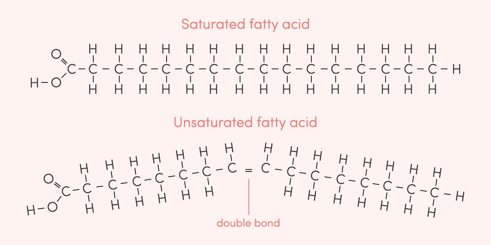
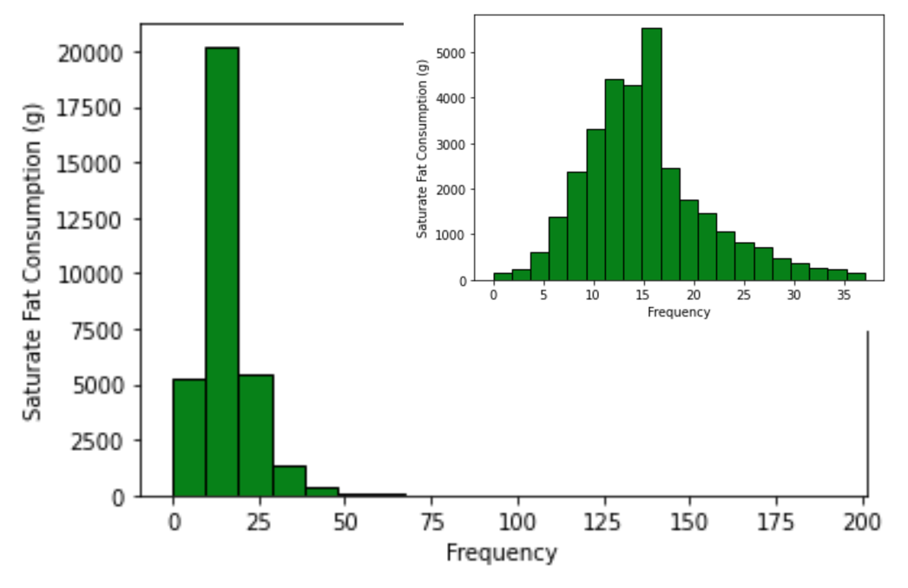
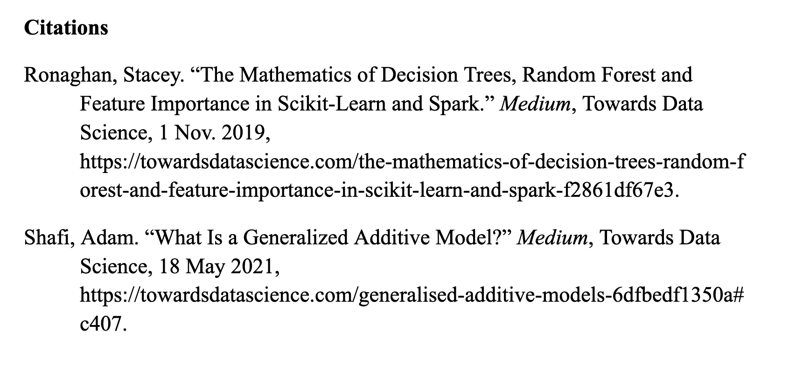

# Predicting Saturated fat Consumption to Gauge Diet Quality in Child WIC Participants
## Background Research
Diet quality in the United States, and globally, has seen a dramatic decrease over the last century. With the almost uniform availability of convenient, cheap, and ultra-processed foods at retail outlets, swift intervention is crucial to safeguarding the health of the population. Although food although food may be available in abundance for many, poverty and food insecurity have a greater role in food choice than is often attributed. When analyzing this affected population, we must define and draw connections between food insecurity and poverty.<br/><br/>
Poverty is a “state in which a person lacks financial and material resources needed to achieve a minimum standard of living” (Conrad, 2022). This metric is computed by the definition set by the federal government: 3 times the cost of a minimum food diet in 1963 (with cost updated for current % inflation). Although the relative number of people in poverty has increased due to population growth, the percentage of households considered below the federal poverty guideline has decreased. As of present, approximately 11% of American households are at or below the poverty guideline, a historical low for the United States.<br/><br/>
Food security is the degree to which the nutritional needs of individuals are impacted by their access to resources (particularly financial resources). There are 3 recognized levels of food security used in public health and nutrition science research – food secure, low food security, and very low food security. Individuals who are food secure are able to acquire sufficient food throughout the year. Low food security, of which ~6.8% of American households are classified, is characterized by uncertainty in obtaining or inability to obtain enough food to meet the nutritional needs of all household members because of insufficient monetary or other resources. Further, very low food security is recognized when normal eating patterns of some or all household members are disrupted and food intake falls below recommended levels, accounting for ~4.3% of Americans households. As suggested in the above descriptions, poverty and food security are closely intertwined. Notably, low food security is categorically considered a type of poverty.<br/><br/>
With the goals of reducing food insecurity and improving diet quality, several government programs were established that provide financial assistance and nutrition education to these affected groups. The Supplemental Nutrition Assistance Program (SNAP) and the Special Supplemental for Women, Infants, and Children (WIC) are the largest and most widely recognized of these programs. SNAP, formerly known as the “food stamp” program, aids over 40 million Americans each year (~11% of the US population at any given time), half of which are children. SNAP provides monthly benefit allocations through an inconspicuous Electronic Benefits Transfer (EBT) card in addition to access to nutrition and food preparation education through the SNAP-Ed program. Benefits, that average $240 per month, are distributed after eligibility is reassessed at the household level of enrolled and prospective participants on a monthly basis. Eligibility is determined based on an assessment of household members’ income, employment, and immigration status. Included in the omnibus Farm Bill, SNAP is funded on a rolling basis, meaning it has no budget cap and therefore serves as many participants as needed. In other words, increased participation in SNAP does not negatively impact the funds allocated to other participants. Although SNAP and WIC conclusively reduce food insecurity, there is no evidence to support that the programs are at all affective at increasing the diet quality of participants. Data collected at the national level shows that people near, at, and below the poverty line and those recognized as food insecure (low or very food secure) have lower diet quality than their higher income counterparts. Moreover, SNAP participants have historically had lower diet quality than eligible non-participants (Zhang et al., 2018). This trend, however, is not observed in WIC participants. WIC provides financial assistance participants to purchase food but is district from SNAP in that it limits purchases with the benefits to a specific list of approved foods for at-home consumption. This group of foods is called the “WIC food package” and includes breakfast cereal, whole grain bread, baby food/formula, milk, cheese, yogurt, tofu, canned fish, soy drinks, eggs, juice, and peanut butter. WIC also offers optional services nutrition counseling, breastfeeding support, and healthcare referrals. Eligibility for this program is determined based on 3 criteria domains: categorial, income, and nutrition. Applicants are deemed categorially eligible if they are a woman who is pregnant, less than 6 months postpartum, breastfeeding a child who is less than 1 year old, or has a child of less than 5 years of age; are income eligible if they are below 1.85 times the poverty line; and are deemed nutritionally eligible based on their risk assessed through a non-standardized clinical assessment. WIC currently supports between 7-9 million women, infants, and children at any given time, meaning around half of all infants in the US are actively enrolled. With rising rates of childhood obesity and diet-related illness, we must consider the program’s effectiveness in meeting the goal of increasing diet quality. One way by assessing the risk of obesity and other health complications. Because metrics such as the weights, heights, and other standard clinical measures of child participants are not available due to privacy concerns, we must use other metrics to infer the health impacts of their diet.<br/><br/>
<br/>
[Image Source](https://www.google.com/url?sa=i&url=https%3A%2F%2Fjoinzoe.com%2Fpost%2Fhealthy-unhealthy-fats&psig=AOvVaw20QznW2gsQZUMe-9GRUV57&ust=1652295834909000&source=images&cd=vfe&ved=0CAwQjRxqFwoTCMi-yefP1fcCFQAAAAAdAAAAABAD)<br/>
One nutrient that is of significant concern in assessing diet quality is the quantity of saturated fat consumed. The structure of saturated fats contains no double bonds, meaning they are fully saturated with H atoms. This structure allows molecules to easily stack, resulting in a solid composition at room temperature. When consumed and metabolized, saturated fats cause the liver to synthesize large volumes of low-density lipoprotein (LDL) “bad” cholesterol and a small quantity of high-density lipoprotein (HDL) “good” cholesterol. Circulating LDL cholesterol can bind to the endothelial lining of the vascular system, resulting in arterial microtears, inflammation, reduced endothelial elasticity, plaque formation, and arterial narrowing. Chronically, these internal implications compound, which leads conditions such as obesity, hypertension, atherosclerosis (heart disease), stroke, and more. The medical implications of food choices are both underestimated and sever so it is of paramount importance to address harmful diet patterns at a young age to reduce or prevent life-threatening conditions that become more apparent during adult years. <br/><br/>

## Methods
#### Variable Selection
The goal of this research is to predict the level of saturated fat consumption in child WIC participants based on age and other dietary metrics such calorie, total fat, sugar, and fiber intake. Although this metric is just one small portion of what someone’s overall diet may look like, saturated fats are found in their highest concentrations in highly processed food pastries, processed or fatty meats, and solids fats such as butter, which may indicate poor diet quality when consumed in excess. The data used will come from the ‘WIC Infant and Toddler Feeding Practices Study-2 (WIC ITFPS-2): Prenatal, Infant Year, Second Year, Third Year, and Fourth Year’ dataset collected by USDA. The dataset contains 32,750 observations of 105 features related to the diets of 0-4 year old participants so a regularization and variable selection procedure will be necessary.<br/><br/>
In project 5, we identified 5 useful variable selection algorithms: Square Root Lasso, Lasso, Ridge, Elastic Net, and SCAD. As in project 5, GridSearchCV was used to identify the optimal choice of alpha for each algorithm. In the cases of Lasso and Elastic Net, the GridSearchCV method did not converge so I wrote my own hyperparameter-tuning function ("try_alphas").

```
def try_alphas(rid = False, lass = False, EN = False, min_val = 0.01, max_val = 1.01, step = 0.1):
  best_alpha = 0
  best_mse = max(y)**2 # note that max(y) > 1
  print(best_mse)
  alphas = np.arange(min_val,max_val,step)
  def test_alpha(a,best_mse,best_alpha):
    print(best_mse)
    model.fit(x,y)
    mae = mean_absolute_error(y,model.predict(x)) # The MAE is low
    print(mae)
    if mae<best_mse:
      best_mse = mae
      best_alpha = a
    return [best_alpha, best_mse]
  for a in alphas:
    if rid == True:
      model = Ridge(alpha=a,fit_intercept=False,max_iter=10000)
      test = test_alpha(a, best_mse,best_alpha)
      best_mse = test[1]
      best_alpha = test[0]
    elif lass == True:
      print(a)
      model = Lasso(alpha=a,fit_intercept=False,max_iter=10000)
      test = test_alpha(a, best_mse,best_alpha)
      best_mse = test[1]
      best_alpha = test[0]
    else: #EN == True:
      model = ElasticNet(alpha=a,fit_intercept=False,max_iter=10000)
      test = test_alpha(a, best_mse,best_alpha)
      best_mse = test[1]
      best_alpha = test[0]
  return [best_alpha, best_mse]
```

Although Ridge was found to be the most accurate and consistent choice on data simulations, Lasso proved most useful on this dataset with a cross-validated MAE of 0.138. Since we are working with high-dimensional data, it was necessary to eliminate a substantial proportion of features to both maximize model performance and to eliminate sources of multicolinearity.
After identifying the variables eliminated by Lasso, I subset the data to isolate the features deemed important for analysis. Among these retained features, I noticed that several of the variables which contributed most strongly were highly correlated with saturated fat consumption. Namely, variables such as total fat and palmitic acid (a type of saturated fat) consumption were logically correlated to total saturated fat consumption so I opted to manually remove these features before proceeding to model testing and selection.<br/>


#### Model Selection
Next, I modeled the relationship between the independent variables (selected using aforementioned algorithm) and the dependent variable (quantity of saturated fat consumed) using numerous modeling techniques. The model types I will compare are  Random Forest Regression and Generalized Additive Modeling.

#### Random Forest Regressor
Before discussing the performance of the random forest in this prediction task, let's first unpack the innerworkings of the regressor.<br/>
A random forest is composed of 'n_estimators' many decision trees, each with a maximum depth defined by max_depth. Random forest regression is a form of supervised learning, which means that the final classification or value of the dependent variable is used to inform the independent construction of each independent decision tree during training. Each tree draws a random sample from the given training data on which it trains and is constructed. For this reason, small quantities of high-dimensional data is more likely to result in overfitting so, in these cases, it may be advantageous to experiment with dimensionality reduction techniques on the dataset. For this reason, since we are working with a large volume of high-dimensional data, we see that random forest regression would be an appropriate next step. After training, the model makes predictions by traversing through all binray trees starting at their root nodes. The algorithm traverses to either the left or right child of the current node. On each node of a tree, a calculated hyper parameter determines which direction to traverse. This hyper parameter is a number falling within the distribution of a dataset feature. For example, if a dataset contains observations of wind speed with a range of 0-50 (feature 1, *x*) and ice cream sales (*y*), a node’s hyper parameter might determine that data with wind speed *w* < 20 falls to the left child and  falls to the right child. During training, trees are constructed recursively from the bottom up. A node can split on several features (the number of features split on at each node is limited to prevent over-reliance on any particular feature for predictions). Subsequent nodes (closer to the leaves of trees) may further split the features represented in the hyper parameters of parent nodes or may split on different parameters. When intializing the model, we also define a parameter called min_samples_split. This integer defines how many training datapoints are required to recur onto a terminal node to split it (ie, as tress are constructed, observations from the selected data subset are recurrently “tested” on their partially complete tree. After traversing this tree, their paths and terminal nodes are recorded. If sufficiently many observations, with distinct y values recur through or onto a node, the node may be split based on identified dissimilarities). Once the minimum samples required to split a node has been reached it may not be that the node is ultimately split - it must first be determined if it is advantageous to split the node by calculating the potential “information gain” or ). For each feature within the tree’s subset of training data, =R(y)-R(y,x_i)) is calculated (Ronaghan, 2018). With the goal of maximizing information gain, this value is used to select which feature () split would result in the highest gain. If a sufficiently large gain is achieved through a hypothetical split, the node is truly split. The function *R* is known as the “impurity criterion” (Ronaghan, 2018) and is selected depending on the datatype of the dependent variable *y*. When predicting a continuous value, mean squared error (MSE) or mean absolute error (MAE) is typically used<br/>
MSE: ^2)<br/>
MAE: <br/>
\* where *N* represents the number of observations in the data subset.<br/>
If a node is split, a new parent node is created, which is populated in the next level up of the decision tree. Once the regressor has been trained, its accuracy and utility can be tested using our reserved quantity of testing data. Testing data point  matriculated through all trees within the forest and each tree returns a prediction for the dependent variable y. These predictions are averaged to provide a final prediction ( for the y value of the test datapoint. Predictions on testing data can then be compared to the true values of the dependent variable using statistical metrics such as MSE, which allows the user gauge the model's accuracy prior to its use. When using a random forest to make predictions, one must recall that the leaves of interal decision trees represent the full, finite range of predictions the model is capable of making. This is one reason why it’s important that we do not extrapolate (use the model to make predictions beyond convex hull of the training data) because our model does not encompass data behavior in these extended regions. As such, we should choose the number of trees based on the range and standard deviation of the dependent feature and will likely achieve better results on data whose dependent variable has a low standard deviation and a narrow range.<br/>
First, we observe that saturated fat consumption in the WIC participant dataset has a range of 191.58 (min of 0, max of 191.58) and a standard deviation of 7.793.<br/>
<br/>
As we can see in the above histogram, the distribution first appears quite wide, however, using the quantile function, we are able to subset the lower portion of data and see that 98% of the data is less than 37.071. When we plot this subset of the dependent feature, we see (in the smaller plot) a relatively normal distribution with a slight right skew. Given the proficiency of random forest in handeling large quantities of high-dimensional training data and the fairly limited range and low standard deviation of the devependent variable, we expect decent performance from this regressor on the WIC participant dataset.<br/>
As expected, random forest performed well, yielding an MSE of 4.002 on unscaled testing data over 10-fold cross validations (note - model performance was signigicantly greater without the use of a scaler on the independent features).

#### Generalized Additive Model (GAM)
Although the random forest model is promising because of its apparent accuacy, its performance is not ideal for a dataset of this size. Each fold of the cross validation took ~1.5 minutes to execute, making this method extremely computationally expensive (which in turn restricts the number of cross validations we can perform). For this reason, we will experiment with one additional model framework - the generalized additive model.

*** How the GAM works ***
At their core, generalized Additive Models (GAMs) are linear models but unlike typical linear models like basic linear regression, GAMs are able to learn nonlinear trends. This learning is achieved by starting with a base linear model . With each iteration, the coefficients () of the model are adjusted. These coefficients, however, are represented by a "flexible function which allows for nonlinear relationships" called a spline (Shafi, 2021). Each spline represents (possible nonlinear) trends within a distinct feature. The sum these splines composes the GAM so we can have up to k splines where k is the number of features in your dataset. More conservative models will use fewer spline and will therefore execute more quickly. Using the reduced WIC dataset, our GAM predictions had an average MSE of 3.654 after a 10-fold cross validation (on the full dataset with all features beside total saturated fat consumption, the MSE was ~).
Each fold of the 10-fold cross validation using a conservative model with 4 splines took ~1 minute to execute, lending to GAM's comparative performance advantage over random forest (note - scaling did not affect the accuracy of GAM). Next, I experimented with a riskier model that was more likely to overfit by increasing the number of splines to 64 (the number of features remaining in the dataset after removing all features directly contributing to fat consumption). Unfortunately, this was too great a demand for Collab so I reduced the number of splines to 32 - predictions using this model had an MSE of 52.653, which indicates clearly that the model was severely overfit (no cross validations were performed since the run time for one iteration/fold was ~15 minutes).
Lastly, we saw the success of gradient boosting in project 3 so using our most successful model (our GAM), I boosted the predictions using decision trees trained on the residuals of predictions.
```
def boosted_gam(X_train, X_test, y_train, y_test):
  # Get predictions from the base GAM model
  gam = LinearGAM(n_splines=5).gridsearch(X_train, y_train,objective='GCV')
  Fx = gam.predict(X_train)
  # Compute the residuals
  new_y = y_train - Fx # vector of residuals on training data
  # Train a decision rree on the residuals, y_i - F(x_i)
  tree_model = DecisionTreeRegressor(max_depth=2, random_state=123)
  tree_model.fit(X_train,new_y)
  # Make boosted predictions
  predictions = gam.predict(X_test)
  output = tree_model.predict(X_test) + predictions
  mse_out = mse(output,y_test) # compute mse
  return mse_out # return the mse of boosted predictions
```
This boosted model had an MSE of 3.604, a slight reduction in MSE compared to the unboosted model (whose MSE was 3.654).


## Results
Although this final boosted GAM model has a seemigly low MSE of 3.604, we must consider that 98% of dependent feature observations fall within the range of 0 - 37.071 and that the standard deviation of all observations is 7.793. Although the above models performance was weakened by removing many of provided features, this change made the model a more accessible tool for parents of child WIC participants. This model tended to over-estimate and under-estimate saturated fat consumption at approximately equal rates (~47% equally or over-estimated, ~53% under-estimated). Moreover, the model didn't appear to high higher rates of over or under estimation for certain age groups (the average age of over-estimated participants was 10.014 months and 9.9 months among under-estimated participants). Overall, this model doesn't appear to be biased in misprediciting certain groups of participants, which is a necessary feature of a model intended for practical use. Although mildly inacurate, the reductioin in required input variables makes this more accessile for use by parents of child WIC participants and their physicians to detect risky dietary patterns at an early age for nutrition intervention, which could help fight back against the growing obesity epidemic and the health consequences it involves.


### Future Research
During the model selection phase, I hoped to use a Locally Weighted Regression (Lowess) as a model to compare other "prepackaged" models to. However, because the reduced dataset contained over 50 features and over 32,000 observatins, Lowess was unable to regress due to maximum runtime constraints. For this reason, I reduced the dataset to 10 features by using a correlation matrix to determine the features with the greatest correlations with the dependent variable. After determining these 10 features, I noticed that several were measures of consumption of specific saturated, monounsaturated, and polyunsaturated fats such as oleic acid. Because the consumption of these fats have a known correlation with saturated fat consumption and because the dietary consumption of these fats are more challenging to measure (a consideration when assessing the utility of the model for the target population, WIC participants), I chose to eliminate these features. After reducing the dataset to 10, easilty measureable features such as carbohydrate, protein, and total caloric consumption, a furhter reduction to just 5 features was made. Given both subsets, Lowess was still unable to regress due to the quantity of large quantity of observations. In the future, as time would allow, I would next use stratified a sampling method to further subset this data by reducing the number of observations while mantaining the original distribution, holding population mean and other metrics constant.<br/>

Additionally, given access to proprietary data, I would like to compare my model's predicted saturated fat consumption of WIC participants to the recommended limit of saturated fat consumption for their age. I would further compare these results to national averages of saturated fat consumption for the child’s age bracket to gauge if WIC is accomplishing its goal improving diet quality in reducing consumption of this specific nutrient. This conclusion could help inform changes to larger nutrition assistance programs such as SNAP that have been unsuccessful with this objective.<br/><br/><br/>

<br/>

[Dataset Link](https://data.nal.usda.gov/dataset/wic-infant-and-toddler-feeding-practices-study-2-wic-itfps-2-prenatal-infant-year-second-year-third-year-and-fourth-year-datasets-0)
