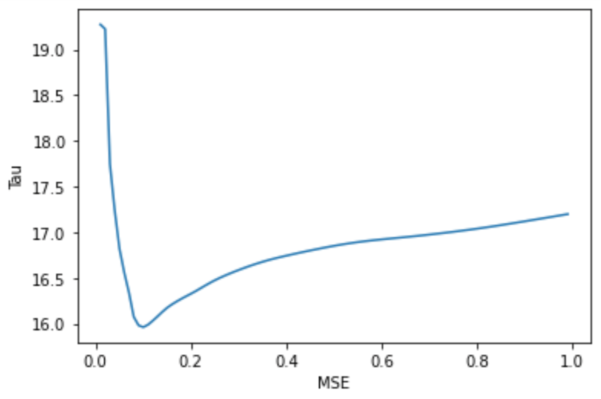
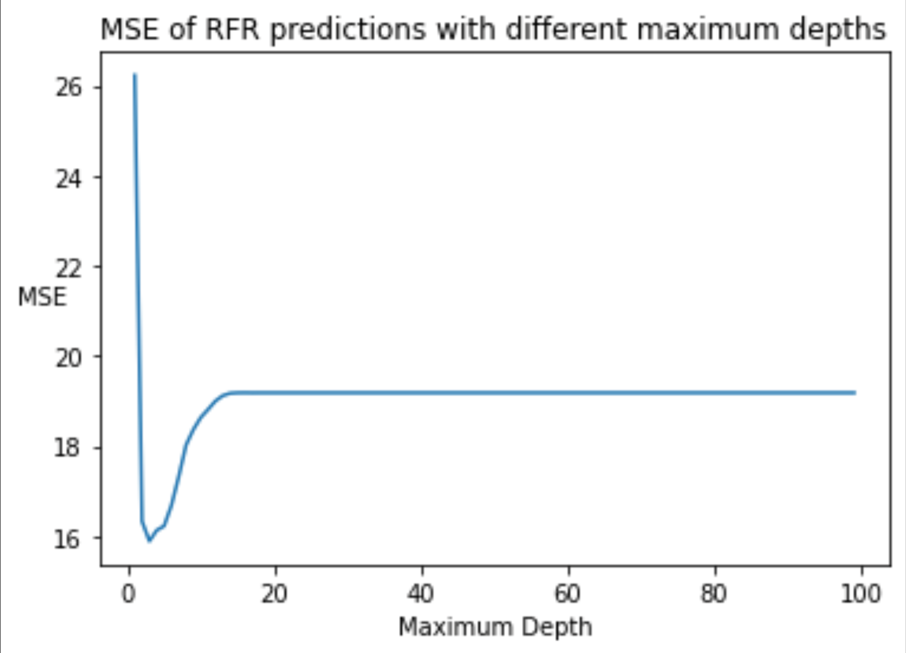
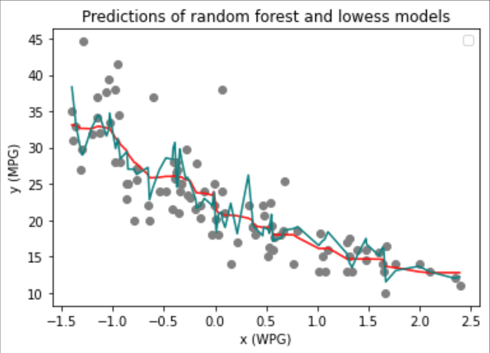

## Project 2: Lowess vs. Random Forest Regression

Based on visibly discernible trends in data, one may come to quick conclusions about approximate parametric (linear) models to represent a
supposed relationship. Although this method may be an appropriate starting place in estimating a model, it is ultimately riddled with uncertainty
and may poorly approximate more specific, localized trends. A more suitable option for such analysis is locally weighted regression, or “lowess”.<br/><br/>
### Math and theory
**Lowess:**<br/>
Lowess approximates non-parametric trends by fitting linear models to sequential subsets of data. Subdivisions are split on intervals within the data based on a computer determined, or user specified, number of points per interval. Let  represent
multidimensional input data (a UxP matrix thats transpose is ) and  be the
dependent variable.

Linear regression is used to determine the linear models fit on the subintervals of X. Linear regression solutions can be seen as a linear combinations of the observed outputs (values of the dependent variable). To understand why this is so, we must further investigate the math behind the form of the linear models. Parametric models assume the form  where
 is independently and identically distributed with mean 0 and standard deviation 1. To determine the  parameters of the model, we write

<br/>
<br/>

We solve for  by assuming  is not rank deficient (assume  is invertible, same as OLS assumption). So,<br/>
^{-1}(X^Ty)-\sigma(X^TX)^{-1}X^T\epsilon).<br/>
We take the expected vlaue of this equation and obtain (where  is )) since =0)<br/>
^{-1}(X^Ty))<br/>
Therefore, the predictions are of the form <br/>
^{-1}(X^Ty))<br/>
Now, we can see that predictions  are linear combinations of  (ie, they are a matrix multiplied by ).<br/>

Lowess uses this same process to estimate parametric equations on data subintervals as described above and since weights are calculated for individual datapoints, we can ensure that although the model may not be smooth, it will be continuous (no breaks or jumps). So, we have<br/>
^{-1}(X^TWy))<br/>
where  are linear combinations of  and the computed weights 

It is important to note that a widely varied distribution of datapoints can lead to overfitting if too few or many points are selected for each interval, however, modifications to the kernal (or "bump") fuction can help reduce this.<br/>
* The indpendent observations are the rows of the matrix . Each row has a number of columns (this is the number of features) - we can denote this number of features by . As such, every row is a vector in .
* Weights (W_i) are computed for each observation (x_i) by plugging the Euclidean distance between this observation and each other observation into the selected kernal function. These weights are represented in an dianal nxn matrix (where n is the number of observations).<br/>
* The Euclidean distance between 2 independent observations is the Euclidean distance (L2 norm) between the two represented -dimensional vectors. The equation is:
=%5Csqrt%7B%5C(v_1-w_1)^2%2B...%2B(v_p-w_p)^2%7D) where  and  represent features of observations  and .<br/>
```
# example - computing the weights for each observation contained in data x
for i in range(1,n):
  # x-x[i]/(2*tau) is plugged into the Euclidean distance formula found in the tricubic kernal function
  # by dividing by 2*tau, we can see how tau influences the bandwidth of K((x-x[i])/(2*tau) (K is the selected kernal)
  weights = tricubic(x-x[i]/(2*tau))
  W = np.diag(weights) # diagonal weights matrix
```
<br/><br/>

**Random forest regression:**<br/>
*Note: Stacey Ronaghan's article cited below was essential in my follwing description of random forest regression.* <br/>
A random forest is composed of 'n_estimators' many decision trees, each with a maximum depth defined by max_depth. Random forest regression is a form of supervised learning. That is, when the binary trees within the forest are constructed, the final classification or value of the dependent variable is known and is used to inform the independent construction of each decision tree (the trees do not interact during training or testing). Each tree draws a random sample from the given training data on which it trains and is constructed. For this reason, small quantities of high-dimensional data is more likely to result in overfitting so, in these cases, it may be advantageous to experiment with dimensionality reduction techniques on the dataset. After training, the model makes predictions by traversing through all binray trees starting at their root nodes. The algorithm traverses to either the left or right child of the current node. On each node of a tree, a calculated hyper parameter determines which direction to traverse. This hyper parameter is a number falling within the distribution of a dataset feature. For example, if a dataset contains observations of wind speed with a range of 0-50 (feature 1, *x*) and ice cream sales (*y*), a node’s hyper parameter might determine that data with wind speed *w* < 20 falls to the left child and  falls to the right child. During training, trees are constructed recursively from the bottom up. A node can split on several features (the number of features split on at each node is limited to prevent over-reliance on any particular feature for predictions). Subsequent nodes (closer to the leaves of trees) may further split the features represented in the hyper parameters of parent nodes or may split on different parameters. When intializing the model, we also define a parameter called min_samples_split. This integer defines how many training datapoints are required to recur onto a terminal node to split it (ie, as tress are constructed, observations from the selected data subset are recurrently “tested” on their partially complete tree. After traversing this tree, their paths and terminal nodes are recorded. If sufficiently many observations, with distinct y values recur through or onto a node, the node may be split based on identified dissimilarities). Once the minimum samples required to split a node has been reached it may not be that the node is ultimately split - it must first be determined if it is advantageous to split the node by calculating the potential “information gain” or ). For each feature within the tree’s subset of training data, =R(y)-R(y,x_i)) is calculated (Ronaghan, 2018). With the goal of maximizing information gain, this value is used to select which feature () split would result in the highest gain. If a sufficiently large gain is achieved through a hypothetical split, the node is truly split. If not, the node remains whole for the time being. Such nodes are continuously reevaluated for further splitting.  is a function known as the “impurity criterion” (Ronaghan, 2018). This function is selected depending on the datatype of the dependent variable *y*. For regression (predicting a continuous value), mean squared error (MSE) or mean absolute error (MAE) can be used<br/>
MSE: ^2)<br/>
MAE: <br/>
\* where *N* represents the number of observations in the data subset.<br/>
If a node is split, a new parent node is created, which is populated in the next level up of the decision tree. Once the regressor has been trained, its accuracy and utility can be tested using our reserved quantity of testing data. Testing data point  matriculated through all trees within the forest and each tree returns a prediction for the dependent variable y. These predictions are averaged to provide a final prediction ( for the y value of the test datapoint. Predictions on testing data can then be compared to the true values of the dependent variable using statistical metrics such as MSE, which allows the user gauge the model's accuracy prior to its use. When using a random forest to make predictions, one must recall that the leaves of interal decision trees represent the full, finite range of predictions the model is capable of making. This is one reason why it’s important that we do not extrapolate (use the model to make predictions beyond convex hull of the training data) because our model does not encompass data behavior in these extended regions.<br/>
### Implementation
After importing the necessary libraries and the cars dataset, I observed a significant difference in the scale of feature observations for x, the independent variable (WGT), and the dependent variable (MPG). For this reason, I opted to rescale x using SKLearn’s standard scaler prior to splitting the data into training and testing batches for each variable. Since I intended to produce graphs to visualize my model accuracy, it was necessary to reorder the data so that the x observations, which would be represented on the x-axis, were in increasing order. There are two logical ways to achieve this sorting, which are outlined below: <br/>

1) Merge observations into a data frame, use the sort_values method to sort based on x observations, and assign training and testing set variable names to the indexed and reshaped columns of the sorted data frame.<br/>

```
# sort the training data
train_sorted = {'xts':xtrain_scaled.ravel(), 'yt':ytrain.ravel()}
# Create training DataFrame and sort it
df_train_sorted = pd.DataFrame(train_sorted).sort_values('xts')
xtrain_scaled = df_train_sorted['xts'].values.reshape(-1,1)
ytrain = df_train_sorted['yt'].values.reshape(-1,1)

# sort the testing data
test_sorted = {'xts':xtest_scaled.ravel(), 'yt':ytest.ravel()}
# Create testing DataFrame and sort it
df_test_sorted = pd.DataFrame(test_sorted).sort_values('xts')
# reassign data object names
xtest_scaled = df_test_sorted['xts'].values.reshape(-1,1)
ytest = df_test_sorted['yt'].values.reshape(-1,1)
```

2) Create a matrix containg the data, sort based on the first column (x train or test) using numpy's argsort method, and assign training and testing set variables to the indexed columns of the matrix

```
# training data
M_train = np.column_stack([xtrain,ytrain])
M_train = M_train[np.argsort(M[:,0])]
xtrain = M[:,0]
ytrain = M[:,1]

# testing data
M = np.column_stack([xtest,test])
M = M[np.argsort(M[:,0])]
xtest = M[:,0]
ytest = M[:,1]
```
This sorting can also happen after predictions are made and the same effect will be achieved.<br/>
Now that the data was prepared, I initialized both the lowess and random forest models. We manually define lowess for 2-dimensional datasets as follows:
```
# tricubic kernal
def tricubic(x):
  return np.where(np.abs(x)>1,0,70/81*(1-np.abs(x)**3)**3)
def lowess_reg(x, y, xnew, kern, tau): 
  # x (independent variable), y (dependent variable), xnew (independent testing observation),
  # kern (desired kernal/bump function), tau (amplitude of bump function)
  # tau is called bandwidth K((x-x[i])/(2*tau))
    n = len(x)
    yest = np.zeros(n)

    #Initializing all weights from the bell shape kernel function    
    w = np.array([kern((x - x[i])/(2*tau)) for i in range(n)])     
    
    #Looping through all x-points
    for i in range(n):
        weights = w[:, i]
        b = np.array([np.sum(weights * y), np.sum(weights * y * x)])
        A = np.array([[np.sum(weights), np.sum(weights * x)],
                    [np.sum(weights * x), np.sum(weights * x * x)]])
        theta, res, rnk, s = linalg.lstsq(A, b)
        yest[i] = theta[0] + theta[1] * x[i] 
    f = interp1d(x, yest,fill_value='extrapolate')
    return f(xnew)

# use the model to make predictions (yhat_test) for the testing data
yhat_test = lowess_reg(xtrain_scaled.ravel(), ytrain.ravel(),xtest_scaled.ravel(), tricubic, 0.01)
```
**Lowess results:**<br/>
I used mean squared error (MSE) to quantify the accuracy of the lowess model, which was found to be 19.274.
Tau influences the amplitude of the bump function, which is used to compute model weights that ultimately contribute to model smoothing. After graphing the original model predictions against the true testing data values, I noticed significant irregularities in the graph and decided to plot the MSE of model predictions after fitting using different values for tau as seen in the code segment below. After determining the minimum MSE achieved, 15.962 using tau = 0.1 as seen in the graph below, I selected a final lowess model.<br/>
```
mse_low = []
for a in np.arange(0.01,1,0.01):
  yhat_test = lowess_reg(xtrain_scaled.ravel(), ytrain.ravel(),xtest_scaled.ravel(), tricubic, a)
  mse_low.append(mse(yhat_test,ytest))
```
Lowess prediction MSE with varying tau values:<br/>
<br/><br/><br/>
<br/><br/>

From a user perspective lowess offers some challenges in both mathematical understanding and implementation so for comparison, let's next look at a random forest. Unlike the scenic random forests pictured above, random forest is another form of non-parametric regression modeling. After initializing a random forest model, I fit the model to the sorted training data using a maximum depth of 2 as a starting point.<br/>


```
# initialize a model
regr = RandomForestRegressor(random_state=123, max_depth=3)
# fit the model
regr.fit(xtrain_scaled, ytrain.ravel())
```
**Random forest results:**<br/>
To qualify the utility of the model, I found the mean squared error (MSE). Since maximum depth can strongly influence model fit (too deep or shallow of trees can result in over or under fitting, particularly in small/medium sized datasets), I repeatedly initialized random forest models with increasing maximum depths while recording the MSE of these models’ predictions on the testing data. This process is outlined in the code segment and following plot below. As we can see, a maximum depth of 3 proved to be ideal in reducing MSE in this case. The MSE of predictions from this final random forest model was 15.887.<br/>
```
mse_all = []
for md in range(1,100):
  regr = RandomForestRegressor(random_state=123, max_depth= md)
  regr.fit(xtrain_scaled, ytrain.ravel())
  rfr_yhat_test = regr.predict(xtest_scaled)
  mse_all.append(mse(rfr_yhat_test,ytest))
```
<br/>
**Concluding remarks:**<br/>
In this example, random forest appears to have slightly out-performed lowess in modeling car miles per gallon (MPG). After graphing both models’ predictions (blue - lowess, red - random forest) along side the true data values (y), I conclude that both models are comparable in their overall utility and are ultimately very similar. Given the range of y (MPG) values in the testing data (10, 44.6) and models' MSEs of ~15.5, I questioned the accuracy of both models. As visible in the aforementioned graph, random forrest offers a more smooth model that contributed to a slightly lower MSE, however, it is clear that the elevated MSEs were influenced by the high variance in y (MPG) among testing observations. From this example alone, one cannot deem a single method “better” than another but rather that each has their own strengths that cannot be fully encompassed by the limited testing performed above.<br/>
<br/>

