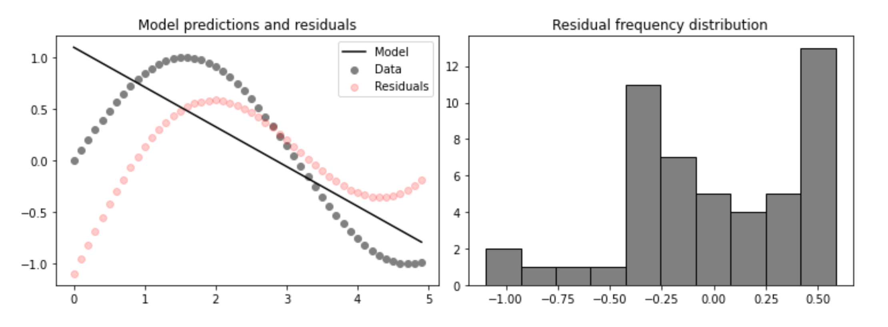
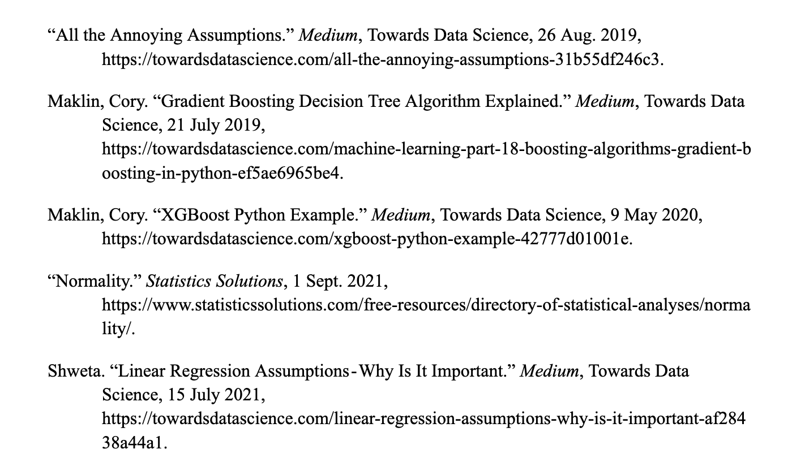

## Project 3: Boosting
**Boosting for Weak Learners**<br/>
The efficacy of regression models is often evaluated based on their stance in the spectrum of learning strength. This learning strength is determined by the distribution of a model’s residuals. A residual is the distance between a model prediction and the true value of the dependent datapoint. Weak learners are characterized by residuals that are not normally distributed. Namely, parametric models fit on data following a non-linear trend, such as ), have residual distribution that mirror the distribution of the data. For example, below we see a linear model fit to ) next to a plot of model residuals, which are non-normally distributed and follow a similar trend to the datapoints themselves.<br/><br/>
<br/>
```
# the code used to produce the above plots
# generate some fake data
x = np.array(np.arange(0,5,0.1)).reshape((-1, 1))
y = np.array(np.sin(np.arange(0,5,0.1)).reshape((-1, 1)))
# fit a linear model
model.fit(x, y)
# make predictions using the model and calculate residuals
y_pred = model.predict(x)
resids = y-y_pred
# plot the results
plt.scatter(x,y, color = 'grey')
plt.plot(x,y_pred, color = 'k')
plt.scatter(x, resids, color = 'red', alpha = 0.2)
plt.title('Model predictions and residuals')
plt.legend(['Model','Data','Residuals'])
plt.hist(resids, color = 'grey', ec = 'black')
plt.title('Residual frequency distribution')
```
Unlike weak learners, strong learners have normally distributed residuals, which allows such models to better encompass the full scope of data represented and are therefore more accurate predictors. The normality assumption is particularly important because it allows us to meaninfully access model accuracy.<br/><br/>
**Extreme Gradient Boosting**<br/>
Boosting is a process in which algorithms convert weak learning models to stronger learners through transformations that improve the normalization of model residuals. Boosting is an important technique because in many cases there is not a well-performing or suitable model to choose from for the intended task at hand. For example, Neural Networks (NNs) are predominantly used in classification problems. Although a NN may be the optimal choice in this case, its performance may be hindered by certain qualities of the data such as insufficient feature representation or unexplained noise. In this case, boosting may be used to improve the accuracy of the model without compromising the use of this preferred modeling technique.
One such method of boosting is called Extreme Gradient Boost, or XGBoost, is a decision tree based regression algorithm. Before unpacking the functionality and utility of XGBoost, we must first understand the inner working of its predecessor, Gradient Boosting. Suppose we have a dataset with n observations. The set’s independent variables are contained in a matrix *X* and the dependent variable y is contained in a column vector *y*. We know that the expected value of any single variable is simply its mean value so =\frac{\sum{y_i}}{n}). The true values  observed in the dataset are each some distance away from the expected value of y. That is, +r_i) for . This distance () is known as the residual of a datapoint. One important assumption that we must abide by in linear and multinomial regression is the normality of residuals since the probability distribution of the beta parameters (model coefficients) are dependent on the distribution of the “error term” (), ie, the residuals. Therefore, models made with this assumption where the residuals are not truly normally distributed will not encompass the complete trend within the dataset. Residuals should be checked for normality in smaller datasets but normality may be assumed for sufficiently large datasets since the central limit theorem holds.<br/>
Unlike regression algorithms such as Random Forest, the decision trees of Gradient Boost are not constructed based on the observed values of *X* and/or *y*, but rather, they are constructed based on the value of the residuals of each datapoint. After calculating the residuals ), a forest of decision trees is then constructed. Each tree is constructed based on a random sample of the calculated residuals of the training dataset. Unlike in Random Forest, XGBoost trees predict residuals (residual = observed *y* value - predicted *y* value) and, as such, the hyper-parameter defined on each node is a residual. When constructing trees, terminal nodes represent the average value of the residuals of all datapoints that traverse to that node during training. Nodes are split on parameters that are determined useful through evaluation by trial and error with the gain function (as described in RFR tree construction in project 2). After training, these trees provide the predicted residual of the target variable from ). The residuals of all trees are averaged to determine a final predicted residual of a testing datapoint, which is added to the expected value of *y* ()) attained from a base model's prediction to attain a boosted prediction of y for the test datapoint. That is,<br/>
+\hat{r})<br/>
An additional model parameter, which helps reduce overfitting is learning rate. Learning rate is a constant by which all residuals are multiplied when predictions are made and impacts the number of trees created, which allows for greater specificity in trees and lowers variance of predictions (and therefore higher accuracy)
=E(y))*+* learning rateresidual
Overall, boosting helps normalize residuals by increasing the specificity of the model (reduces the distance between observed values and the model itself). This process, however, can lead to overfitting. XGBoost improves upon gradient boosting by reducing the likelihood of overfitting using several additional parameters.<br/>
During tree construction for XGBoosting, gain and loss functions are used to access the accuracy of a tree if a node split were to occur. Nodes are split if a positive gain and a sufficient decrease in loss results from a split. The sufficiency of a reduction in loss is defined by  and .  is “the minimum loss reduction required to make a further partition on a leaf node of the tree”. We hope to pick a threshold gamma that results in the highest possible gain. Additionally,  is a regularization parameter used in XGBoosting.  “reduces the prediction’s sensitivity to individual observation”, effectively balancing the generality and specificity of the provided model ( is included in the calculation of the average residual returned by all trees to reduce the sensitvity of changes. That is, the residual returned (  is  where n_estimators is the number of decision trees). Both parameters,  and , are used to calculate gain and loss. This splitting evaluation process is repeated for each leaf, which splits between neighboring datapoints. The goal of splitting nodes is to maximize the collective gain of a tree while minimizing loss.<br/><br/>
**Boosting Implementation**<br/>
In practice boosting can be implemented through a variety of methods. For the purpose of drawing distinctions between the methods discussed above, we will examine the implementation and performance of Lowess, boosted Lowess, and XGBoost. To account for differences in performance depending on sample selection, we will repeat model training and testing, using K-Fold sampling with a different random state 100 times. With repetition, differences in performance will smooth as approach the true MSE of the model.<br/>
For our base model, we will use the implementation of locally weighted regression seen in project 2. As a brief reminder, locally weighted regression (Lowess) is a regression algorithm that approximates non-parametric trends by fitting linear models to sequential subsets of data. Although the subdivided linear models within a Lowess model offer greater specificity than a simple, straight-line linear model, there is room to fine tune the specificity of these regions using boosting. One consideration to make before boosting a Lowess model is the quantity of available training and testing data. By boosting a model trained on a small quantity of data, limitations are made in the scope of the data that model encompasses, which may result in overfitting. Here, we will write a boosting function for Lowess using gradient boosting. To view an implementatoion of the Lowess regressor function, named lw_reg, please see project 2.
```
# Boosting Lowess
r = random_state # randomly selected random state
def boosted_lwr(X, y, xnew, kern, tau, intercept):
  # Get predictions from the orginal Lowess model
  Fx = lw_reg(X,y,X,kern,tau,intercept)
  new_y = y - Fx # vector of residuals
  # Train the Decision Tree on the residuals, y_i - F(x_i)
  tree_model = DecisionTreeRegressor(max_depth=2, random_state=r)
  tree_model.fit(X,new_y)
  # Make boosted predictions = predicted residual + original prediction (h_i + F(x_i))
  output = tree_model.predict(xnew) + lw_reg(X,y,xnew,kern,tau,intercept)
  return output 
```
As seen in the above code snippet, the gradient booster functions by creating a decision tree trained to predict the residuals of datapoints. The tree is trained on the residuals of Lowess ()). The residuals predicted by the tree are summed with the original predictions from Lowess, giving us a vector of boosted predictions.
As mentioned above, the use of gradient boosting can result in overfitting so in hopes of final improvements in model fit, we will implements XGBoosting.<br/>
Of the numerous customizable parameters of XGBoost, the gamma and reg_lambda parameters correspond directly to constants found in the method’s the loss and gain functions used to construct the regressor’s trees so it may be necessary to adjust these values through trial and error to perfect overall fit. Like in random forest regression, n_estimators and max_depth dictate the quantity and maximum depth of the model’s decision trees. One additional parameter included is the objective specification, which allows users to specify the type of task the model will be completing. This helps the interpretation of the input parameters and helps determine the expected values of y to which the XGBooster’s predicted residuals will be added.<br/><br/>
**Concluding Remarks**
```
mse_lwr = [] # lowess
mse_blwr = [] # boosted lowess
mse_xgb = [] # XG Boosting

num_iter = 100
rand_states = [random.randint(1,100000) for r in range(num_iter)]

for i in rand_states: # as we increase the number of times we loop (changing the random state), we approach the true MSE of the methods
  kf = KFold(n_splits=10,shuffle=True,random_state=i)
  # this is the Cross-Validation Loop
  for idxtrain, idxtest in kf.split(X):
    # training data
    xtrain = X[idxtrain]
    xtrain = scale.fit_transform(xtrain)
    ytrain = y[idxtrain]
    
    # testing data
    xtest = X[idxtest]
    xtest = scale.transform(xtest)
    ytest = y[idxtest]
    
    # define the models
    yhat_lwr = lw_reg(xtrain,ytrain, xtest,Tricubic,tau=1.2,intercept=True)
    yhat_blwr = boosted_lwr(xtrain,ytrain, xtest,Tricubic,tau=1.2,intercept=True)
    model_xgb = xgb.XGBRegressor(objective ='reg:squarederror',n_estimators=100,reg_lambda=20,alpha=1,gamma=10,max_depth=3)
    model_xgb.fit(xtrain,ytrain)
    yhat_xgb = model_xgb.predict(xtest)

    # record the MSEs
    mse_lwr.append(mse(ytest,yhat_lwr))
    mse_blwr.append(mse(ytest,yhat_blwr))
    mse_xgb.append(mse(ytest,yhat_xgb))

# Report the cross-validated MSE of each method
print('The Cross-validated Mean Squared Error for LWR is : '+str(np.mean(mse_lwr)))
print('The Cross-validated Mean Squared Error for BLWR is : '+str(np.mean(mse_blwr)))
print('The Cross-validated Mean Squared Error for XGB is : '+str(np.mean(mse_xgb)))
```
After 100 repetitions of model fitting and testing, the recorded MSEs were averaged and returned. The cross-validated MSE for Lowess was 17.046 whereas the MSE of Boosted Lowess was 17.697. This increase in MSE suggests that Boosted Lowess was overfit and may need adjusted hyper-parameters. After adjusting the bandwidth, I found that the optimal value was tau = 0.89, which reduced the MSE for boosted Lowes to 17.227. Finally, XGBoosting had an MSE of 16.168, demonstrating it’s superior ability to balance model specificity and generality over Lowess and Boosted Lowess in this example on the Cars dataset.
As seen above, XGBoost offered the best performance of the regression algorithms above, however, it’s important to note that each algorithm and boosting method offers benefits for various specific tasks. For example, it may be beneficial to use a boosted Neural Network rather than XGBoost in classification tasks. Additionally, though only Lowess was boosted in the above implementation, boosting can be employed on any regression algorithm, offering hope of continued improvement in the learning strength of both novel and antiquated regression algorithms alike.<br/><br/>
**Citations**<br/><br/>
<br/>
