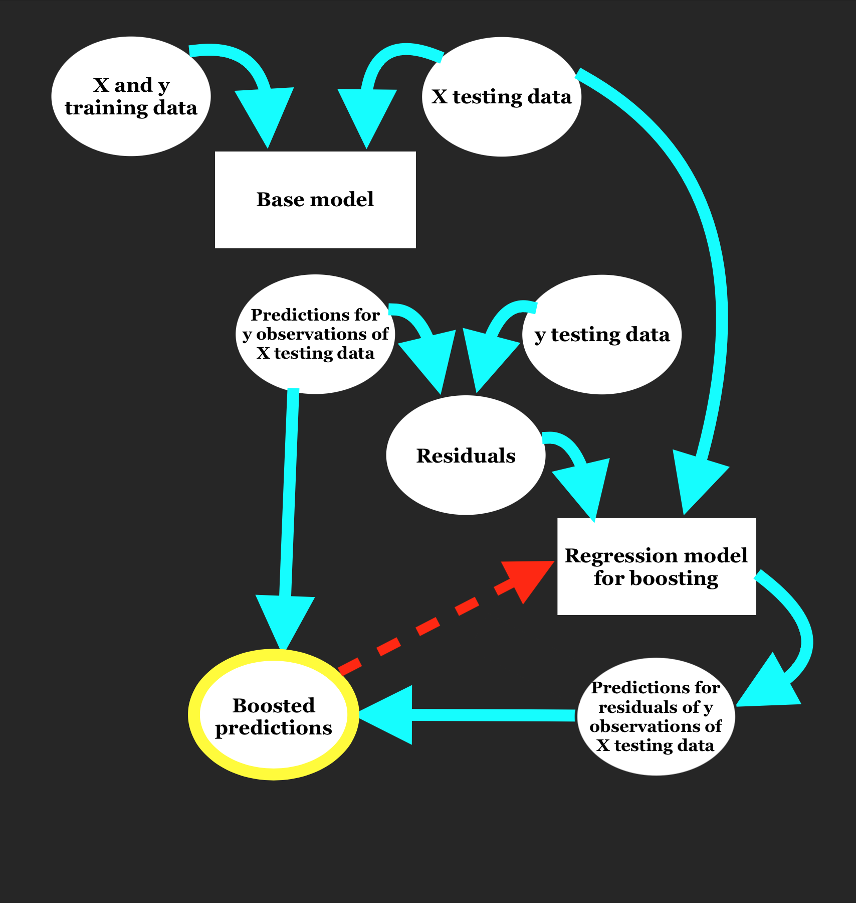
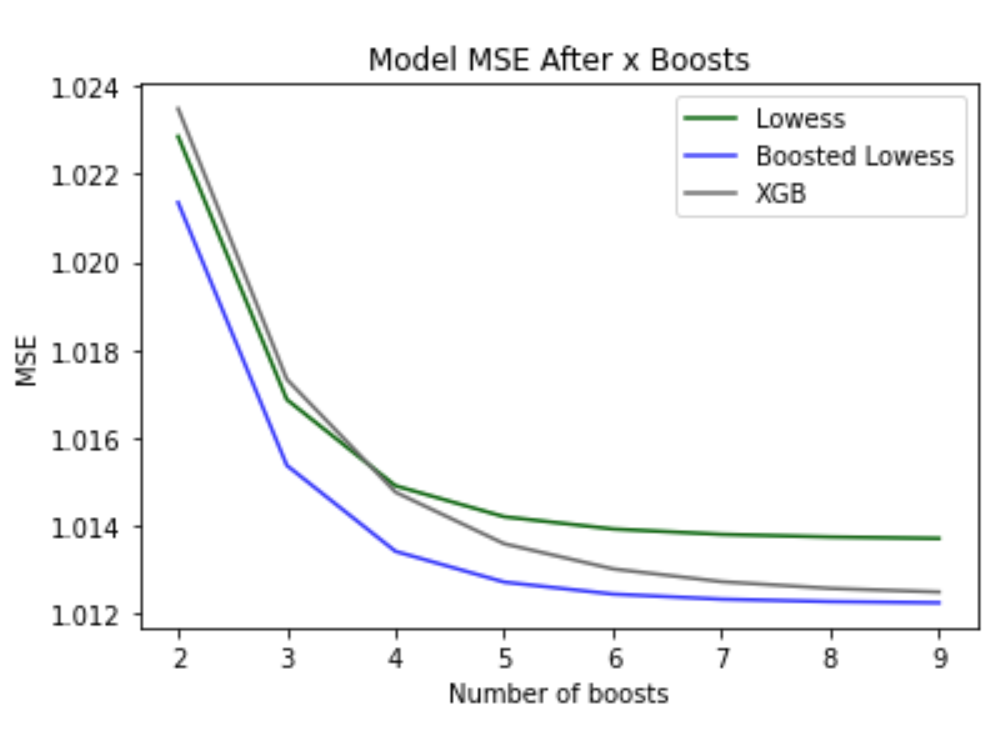

### Repeated Boosting With Lowess
As seen in project 3, boosting can be used to improve model specificity through the normalization of residuals. Although we observed some improvement in accuracy through reductions in cross-validated MSE with the use of gradient and extreme gradient boosting, there may still be potential to decrease model MSE. The general framework of boosting is as outlined in the diagram below.<br/><br/>
<br/><br/>
Boosting can seem like a difficult and convoluted process, as suggested by the diagram, but it’s truly more streamlined than it appears. Essentially, the boosting process has 4 steps:
1.	Fit a base regression model to training data and attain model predictions for testing data
2.	Calculate model residuals for the testing data
3.	Fit a new regression model to these residuals and make predictions for residuals of the testing data
4.	Compute boosted predictions by summing the base model predictions (step 1) and the predicted residuals (step 3)
Just as boosting improves the specificity of model predictions, we can also use boosting to improve residual predications. By improving residual predictions, our overall boosted predictions will be more accurate. This is achieved through repeated boosting, in which boosted predictions are diverted back into the secondary boosting model to make predictions of the residuals of the boosted predictions. This boosting step, depicted in red in the diagram, can be repeated as many times as is specified by the user, although improvement in results will plateau over time (and can potentially overfit).
<br/>
Since we can boost predictions using any regression model, I chose to experiment with boosting using Lowess. This method relied on two functions in addition to the Lowess regressor, which is described in detail in project 1. These two functions are defined as follows:

```
def boost_with_lw_reg(base_model_predictions,X, y, xnew, kern, tau, intercept):
  # compute the residuals
  new_y = y - base_model_predictions
  # make predictions of residuals using Lowess
  resid_predictions = lw_reg(X,new_y,xnew,kern,tau,intercept)
  # return the boosted predictions
  output = resid_predictions + base_model_predictions
  return output

def booster(X,y,xnew,kern,tau,base_model_predictions,nboost):
  # if nboost = 0, user just wants lowess predictions
  if nboost ==0:
    return lw_reg(X, y, xnew, kern, tau, intercept==True)
  # first boost
  output = boost_with_lw_reg(base_model_predictions,X, y, xnew, Tricubic, 0.01,intercept = True)
  # repeated boosting
  if nboost>1:
    for i in range(nboost):
      output = boost_with_lw_reg(output,X, y, xnew, Tricubic, 0.01,intercept = True)
  return output
```

Lower values of tau were found to result in lower MSEs for Lowess and Boosted Lowess for the concrete dataset so tau = 0.01 was selected. As seen in the implementation above, boost_with_lw_reg is responsible for calling the Lowess function (lw_reg) on the residuals of user-provided predictions. These predictions can be given by any regression model; this choice of base model will be further examined below.<br/>
The booster function serves as a helper function, calling the boost_with_lw_reg on the provided base model predictions, and later on boosted predictions if the number of boosts specified (nboost) is greater than one, initiating repeated boosting. If nboost = 0, the provided base model predictions will be returned and no boosting will occur.<br/>

```
mse_lwr = [] # lowess
mse_blwr = [] # boosted lowess
mse_xgb = [] # XG Boosting
mse_lw_multi_lw_boost = []
mse_blw_multi_lw_boost = []
mse_xgb_multi_lw_boost = []

num_iter = 10
rand_states = [random.randint(1,100000) for r in range(num_iter)]
num_boosts = 2

# as we increase the number of times we loop (changing the random state), we approach the true MSE of the methods
for i in rand_states:
  kf = KFold(n_splits=10,shuffle=True,random_state=i)
  # this is the Cross-Validation Loop
  for idxtrain, idxtest in kf.split(X):
    # training data
    xtrain = X[idxtrain]
    xtrain = scale.fit_transform(xtrain)
    ytrain = y[idxtrain]
    # testing data
    xtest = X[idxtest]
    xtest = scale.transform(xtest)
    ytest = y[idxtest]

    # define the models
    yhat_lwr = lw_reg(xtrain,ytrain, xtest,Tricubic,tau=0.01,intercept=True) # 40 predictions
    yhat_blwr = boosted_lwr(xtrain,ytrain,xtest,Tricubic,tau=0.01,intercept=True)
    model_xgb = xgb.XGBRegressor(objective ='reg:squarederror',n_estimators=300,reg_lambda=0,alpha=1,gamma=5,max_depth=3)

    model_xgb.fit(xtrain,ytrain)
    yhat_xgb = model_xgb.predict(xtest)
    # record the MSE
    mse_lwr.append(mse(ytest,yhat_lwr))
    mse_blwr.append(mse(ytest,yhat_blwr))
    mse_xgb.append(mse(ytest,yhat_xgb))

    # Boosted MSEs
    boosted_pred_lw = booster(xtest,ytest,xtest,Tricubic,.01,yhat_lwr,num_boosts)
    boosted_pred_blw = booster(xtest,ytest,xtest,Tricubic,.01,yhat_blwr,num_boosts)
    boosted_pred_xgb = booster(xtest,ytest,xtest,Tricubic,.01,yhat_xgb,num_boosts)
    # record the MSE
    mse_lw_multi_lw_boost.append(mse(ytest,boosted_pred_lw))
    mse_blw_multi_lw_boost.append(mse(ytest,boosted_pred_blw))
    mse_xgb_multi_lw_boost.append(mse(ytest,boosted_pred_xgb))

# Report the cross-validated MSE of each method
print('The Cross-validated Mean Squared Error for LWR is : '+str(np.mean(mse_lwr)))
print('The Cross-validated Mean Squared Error for LW Boosted LWR is : '+str(np.mean(mse_lw_multi_lw_boost)))

print('The Cross-validated Mean Squared Error for BLWR is : '+str(np.mean(mse_blwr)))
print('The Cross-validated Mean Squared Error for LW Boosted BLWR is : '+str(np.mean(mse_blw_multi_lw_boost)))

print('The Cross-validated Mean Squared Error for XGBoost is : '+str(np.mean(mse_xgb)))
print('The Cross-validated Mean Squared Error for LW Boosted XGBoost is : '+str(np.mean(mse_xgb_multi_lw_boost)))
```
Using data from the Concrete Compressive Strength dataset (of which all variables were deemed significant through a t-test on the \beta coefficients of a simple multiple regression model, however, due to run time constraints the 3 most significant independent variables were selected for use), this method, the MSE of Lowess predictions decreased from 6.161 to 5.796, MSE of Gradient Boosted Lowess decreased from 5.955 to 5.556, and MSE of XGBoost decreased from 40.990 to 6.143 with just 2 boosts. With adjustments to the lambda, gamma, and n_estimators parameters of the XGBoost model, these MSEs were reduced to 16.141 prior to boosting and after 4.864 boosting.<br/>
Note: if tau is selected to be ~1, the MSEs of Lowess and Gradient Boosted Lowess are greater than that of XGBoost. Setting tau this low may lead to overfitting, however, we will risk it for the sake of exploration.<br/>
Encouraged by the success of using 1 boost, I next determined the optimal number of boosts to use by repetitively boosting each method and recording the average MSE of the method with n boosts.
```
# Temporary storage of boosted MSEs from each iteration to average (number of iterations specified by rand_states)
mse_lw_multi_lw_boost = []
mse_blw_multi_lw_boost = []
mse_xgb_multi_lw_boost = []

# MSE for each method after n boosts
mse_all_boosts_lw = []
mse_all_boosts_blw = []
mse_all_boosts_xgb = []

num_iter = 10
rand_states = [random.randint(1,100000) for r in range(num_iter)]
num_boosts = 10

for n in range(num_boosts):
  for i in rand_states:
    kf = KFold(n_splits=10,shuffle=True,random_state=i)
    # this is the Cross-Validation Loop
    for idxtrain, idxtest in kf.split(X):
      # training data
      xtrain = X[idxtrain]
      xtrain = scale.fit_transform(xtrain)
      ytrain = y[idxtrain]
      # testing data
      xtest = X[idxtest]
      xtest = scale.transform(xtest)
      ytest = y[idxtest]

      # define the models
      yhat_lwr = lw_reg(xtrain,ytrain, xtest,Tricubic,tau=0.01,intercept=True) # 40 predictions
      yhat_blwr = boosted_lwr(xtrain,ytrain,xtest,Tricubic,tau=0.01,intercept=True)
      model_xgb = xgb.XGBRegressor(objective ='reg:squarederror',n_estimators=300,reg_lambda=0,alpha=1,gamma=5,max_depth=3)


      model_xgb.fit(xtrain,ytrain)
      yhat_xgb = model_xgb.predict(xtest)

      # Boosted MSEs (boosting n times)
      boosted_pred_lw = booster(xtest,ytest,xtest,Tricubic,.01,yhat_lwr,n)
      boosted_pred_blw = booster(xtest,ytest,xtest,Tricubic,.01,yhat_blwr,n)
      boosted_pred_xgb = booster(xtest,ytest,xtest,Tricubic,.01,yhat_xgb,n)
      # record the MSE
      mse_lw_multi_lw_boost.append(mse(ytest,boosted_pred_lw))
      mse_blw_multi_lw_boost.append(mse(ytest,boosted_pred_blw))
      mse_xgb_multi_lw_boost.append(mse(ytest,boosted_pred_xgb))

  # Record the MSE after n boosts of each method
  mse_all_boosts_lw.append(np.mean(mse_lw_multi_lw_boost))
  mse_lw_multi_lw_boost = []
  mse_all_boosts_blw.append(np.mean(mse_blw_multi_lw_boost))
  mse_blw_multi_lw_boost = []
  mse_all_boosts_xgb.append(np.mean(mse_xgb_multi_lw_boost))
  mse_xgb_multi_lw_boost = []

# plot the MSEs over n boosts
plt.plot(range(10),mse_all_boosts_lw,color = 'darkgreen')
plt.plot(range(10),mse_all_boosts_blw, color = 'blue', alpha = 0.8)
plt.plot(range(10),mse_all_boosts_xgb, color = 'dimgrey')
plt.title('Model MSE After x Boosts')
plt.xlabel('Number of boosts')
plt.ylabel('MSE')
plt.legend(['Lowess','Boosted Lowess','XGB'])

```
<br/><br/>
As seen in the plot above, improvements to the MSEs of Lowess and Gradient Boosted Lowess plateaued at around 1.013 and 1.012 from 6 boosts and the MSE of XGBoost plateaued at around 1.012 from 10 boosts (not pictured in plot). Overall, this method resulted in a total reduction in MSE of 5.147 for Lowess, 4.942 for Gradient Boosted Lowess, and 15.128 for XGBoost. Models for this dataset didn’t appear to overfit from increasing the number of boosts, unlike the Cars dataset. After applying the same above criteria to the Cars dataset, the MSEs of Lowess and Gradient Boosted Lowess were minimized to 11.459 and 11.599 using 6 boosts and the MSE of XGBoost was minimized to 11.519 with 5 boosts, however, after this minimum was reached, the MSEs of these boosteded models increased once the number of optimal boosts was exceeded.<br/><br/>
### LightGBM
Boosting using the Lowess algorithm contrasts the use of decision tree construction in other boosting methods. In particular, we have used gradient boosting and extreme gradient boosting (XGBoosting) in projects 2 and 3 that, unlike Lowess, rely on decision trees in their efforts to normalize model residuals. One additional gradient boosting method we have not yet encountered is LightGBM.
As mentioned above, feature selection was necessary prior to boosting predictions using Lowess and the same is true when boosting using gradient boosting or XGBoost due to the heightened model complexity and overall inefficiency that results from the use of numerous independent features and large quantities of data. Without feature selection, extended runtimes were experienced, which resulted in the terminal timing out before regression could complete. LightGBM presents a solution to this problem, which accommodates the use of large quantities of high-dimensional data. Before exploring this solution, we must first understand the sources of inefficiency in traditional decision tree-based regression algorithms.
As described in project 1, when a forest of decision trees is constructed, each tree is trained on a random subset of the data. Sampling is repeated n_estimators times, once for each tree, so that each datapoint is selected at least once. This process, however, is inefficient and discounts the inherent similarities between datapoints and collinearity among features. LightGBM addresses these issues in two phases
1.	Weighted datapoint selection
2.	Feature bundling
First, lightGBM determines which datapoints are most influential in model construction. This novel sampling technique, called Gradient-Based One-Side Sampling (GOSS), reduces the quantity of data used without compromising the integrity of the original data distribution. First, the observations (vectors) in highest a\cdot100% of gradients will be selected for the sample (where *a* is a user-specified parameter). Next, a random sample of b\cdot100% of the remaining data will be added to the sample (where *b* is a user-specified parameter). The random nature of this second round of selection allows our sample to maintain the shape of the original data distribution.
Once the data subset is selected, feature bundling is used to reduce the dimensionality of our subset. This technique allows for further data condensation while minimizing information loss. Before combining features, the merge algorithm identifies exclusive features; those that simultaneously attain nonzero values. These features are combined into an “exclusive feature bundle” by offsetting the values of each feature so they are disjoint sets before merging. For example, if feature A has range \[5-15) and feature B has range \[10,30\], we can offset B by 5 units so that B has an adjusted range of [15,35] and A\cap B = \varnothing. Offsetting the features ranges is important so we can later separate out the distinct sub-features within the combined feature. Now that our dataset has been sufficiently condensed, gradient boosting is performed on the residuals of predictions (essentially, XGBoosting is performed on our modified data), leaving us with final boosted predictions.
