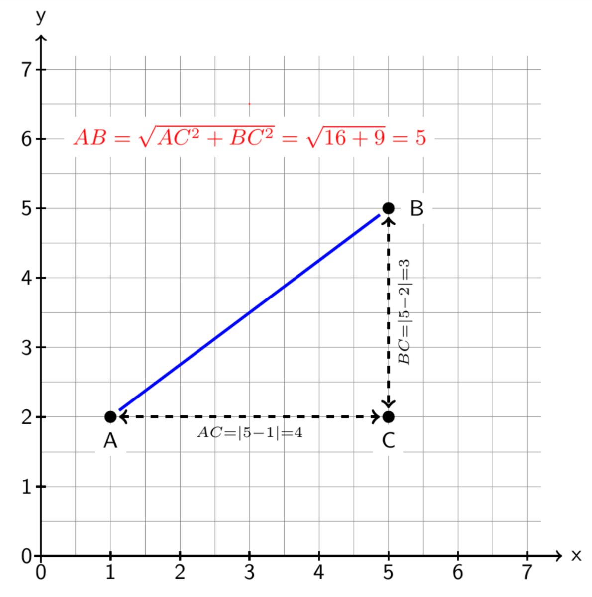
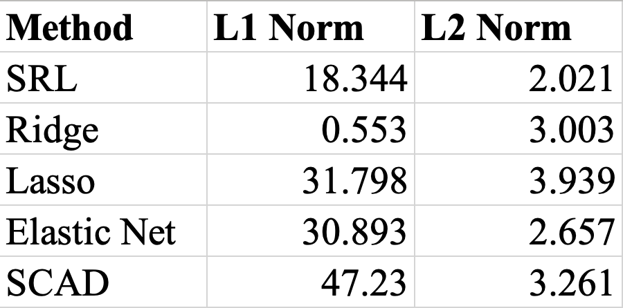
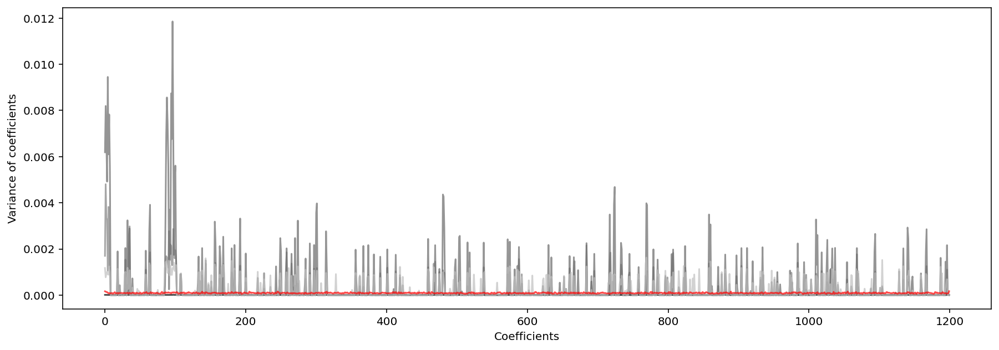
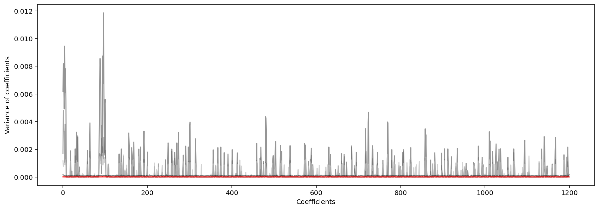
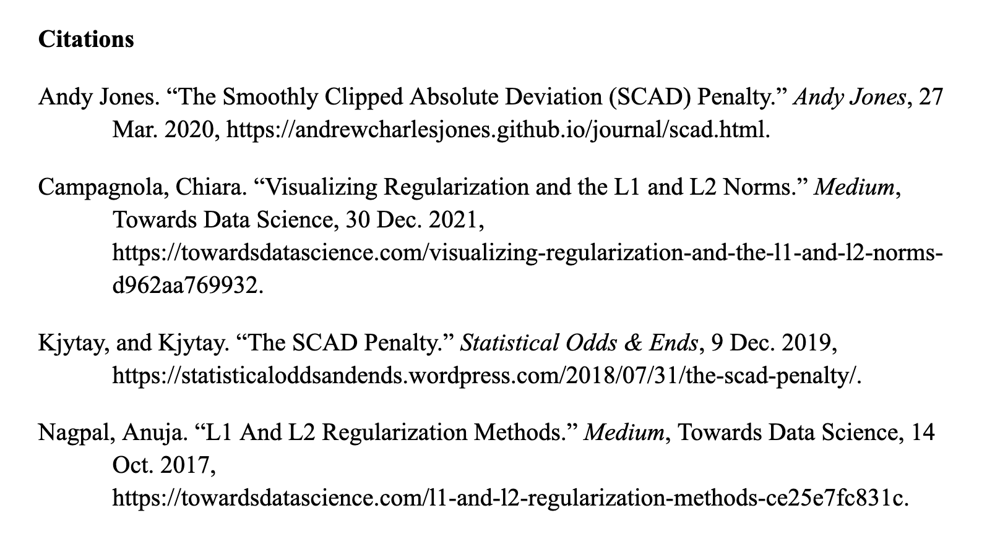

## Project 5: Regulatization Methods
### Regularization and Variable Selection
Regularization is “a constraint is imposed on the weights such as a bound for the sum of the squared weights or the sum of the absolute value of the weights”. This constraint minimizes regression loss functions, which in turn limits the absolute values of model coefficients (meaning they remain closer to 0 or some other imposed bound such as the mean). By minimizing the magnitude of the coefficients, we can eliminate variables whose coefficients are found to be 0. A statistical t-test is used to determine which coefficients are significantly different from 0 so that features whose coefficients are deemed insignificant can be eliminated (coefficients equivalent to 0 so these features do not contribute significantly to predictions). Collectively, variable selection using regularization algorithms is used to improve model fit by helping to prevent or reduce overfitting and underfitting. For this project, we’ll explore 5 regularization methods: Square Root Lasso, Lasso, Ridge, Elastic Net, and SCAD.<br/><br/>

An **objective function** is a function of two or more variables used to assess the accuracy of a regression model. As the goal in modeling is to the improve overall accuracy of predictions, we aim to identify how we can minimize this objective function by making changes to the model coefficients using a gradient descent algorithm. We can visualize the errors of as a convex plane. By adjusting the vector of coefficients  by *t* units in the direction of some , we can traverse the plane of L, finding the direction of change that results in the greatest progress in reaching the minimum of L (and therefore minimizes the L2 norm). <br/><br/>
<br/><br/>
[Image source](https://blog.paperspace.com/intro-to-optimization-in-deep-learning-gradient-descent/)<br/>
The goal of minimizing the objective function is to approach the ground truth estimation of  (the optimal model coefficients). Since  and so  where  is noise. To minimize this noise, we look for the maximum decrease in the partial derivative of the L2 norm  (the Euclidean distance between the estimated coefficients and the ideal solution that minimizes the objective function) with respect to . We get a partial derivative of h_j(X)}{||y-X\beta||_2}), which suggests that we should instead minimize the L2 norm + a regularization term (opposed to only minimizing the L2 norm as suggested above). In order to find the direction of the most dramatic reduction in L, we first obtain the gradient of the objective function (L). We can represent the convex plane of L as vector field, which is composed of the gradient the vectors on individual datapoints (vectors are tangent to points on the plane and indicate the direction and slope (rate of change) of L at each point. <br/><br/>

### Generating Data and Selecting Model Hyperparameters
Data simulations are useful for testing both the accuracy of models and the consistency of variable selection algorithms. Consistency is a measure of “the stability of a sparsity pattern for the weights when we run many k-Fold cross-validations”. This this case, we allow our synthetic data to be influenced by our ground truth beta coefficents, and other hyperparameters such as n, p, v, sigma, and mu, so that models fit to the data should have coefficients resembleing the ground truth coefficients (ie, the coefficients beta_star). We are able to achieve this using the toeplitz and matmul methods.
```
beta_star = np.concatenate(([1]*7,[0]*25,[0.25]*5,[0]*50,[0.7]*15,[0]*1098)) # ground truth coefs
n = 200 # number of observations
p = 1200 # number of features
v = []

# correlation between features i_i and j_j is approximately 0.8^{|i-j|}
for i in range(p):
  v.append(0.8**i)

mu = [0]*p
sigma = 3.5
np.random.seed(123)
data = [] # collect the datasets

for r in range(100): # generate 100 sets of fake data
    x = np.random.multivariate_normal(mu, toeplitz(v), size=n)
    y = np.matmul(x,beta_star).reshape(-1,1) + sigma*np.random.normal(0,1,size=(n,1)) # add noise that is normally distributed
    data.append([x,y])
```
Lastly, before moving on to implementing our 5 regularization techniques, we must decide on the optimal hyperparameters for the models, which we will accomplish using GridSearchCV. GridSearchCV takes a model, any hyperparameters, and lists of values falling throughout their corresponding parameter's possible range. When called and fit on your provided x and y data, GridSearchCV will itterate through all possible combinations of the hyperparameters provided, testing model performance at each step, and returning a dictionary containing the optimial choices of parameters that will yield the greatest performance. Although computationally expensive, GridSearchCV ensures that we pick the right parameters on our first try, achieve the best possible results, and eliminate much of the trial and error or guess work typically associated with this process. All hyperparameters specified for the methods below were determined by GridSearchCV.<br/>

### Square Root Lasso

The first method we will explore to minimize the objective function + a penalty is the Square Root Lasso (SRL) function. As the name suggests, SRL minimizes the objective function (+ penalty) by minimizing the square root of the objective function. In this case, our objective function is mean squared error, ^2}).<br/>
For SRL, the penalty term we add to the objective function is defined as  where *p* is the number of features,  is a constant hyperparameter representing the probability of a model coefficient being 0.
Although SRL is available through the SkLearn module, we will write our own SRL class for the purpose of further understanding its methodology. We will, however, make this class and its contained methods SkLearn compliant to mimic the utility of the prepackaged methods. <br/>

```
class SQRTLasso(BaseEstimator, RegressorMixin):
    def __init__(self, alpha=0.01):
        self.alpha = alpha
  
    def fit(self, x, y): # fit the model
        alpha=self.alpha
        @njit
        def f_obj(x,y,beta,alpha):
          n =len(x)
          beta = beta.flatten()
          beta = beta.reshape(-1,1)
          output = np.sqrt(1/n*np.sum((y-x.dot(beta))**2)) + alpha*np.sum(np.abs(beta))
          return output
        @njit
        def f_grad(x,y,beta,alpha):
          n=x.shape[0]
          p=x.shape[1]
          beta = beta.flatten()
          beta = beta.reshape(-1,1)
          output = (-1/np.sqrt(n))*np.transpose(x).dot(y-x.dot(beta))/np.sqrt(np.sum((y-x.dot(beta))**2))+alpha*np.sign(beta)
          return output.flatten()
        
        def objective(beta): # wrapper function that calls f_obj to compute the value of the square root of the objective function (square root of the MSE)
          return(f_obj(x,y,beta,alpha))
        
        def gradient(beta): # wrapper function that calls f_grad to compute the gradient
          return(f_grad(x,y,beta,alpha))
        
        beta0 = np.ones((x.shape[1],1))
        output = minimize(objective, beta0, method='L-BFGS-B', jac=gradient,options={'gtol': 1e-8, 'maxiter': 50000,'maxls': 25,'disp': True})
        beta = output.x
        self.coef_ = beta
        
    def predict(self, x): # make predictions (datapoint * selected/proposed beta coefficients)
        return x.dot(self.coef_)
```

After initializing the SRL class with a baked-in alpha hyperparameter, we define the fit, f_grad, objective, gradient, and predict methods. In order to make these functions SkLearn compliant, we use the BaseEstimator and RegressorMixin classes, which allow us to concatenate functions using an underscore. For example, when we call model.fit_transform, which will sequentially call the fit method followed by the transform method. As discussed earlier, the minimization of the objective function is reliant on determining the direction of its most dramatic decrease, which is determined by finding the gradient vector of the MSE associated with the model using the updated versions of the original coefficients. Essentially, this process can be thought of as traversing the plane of L by updating the model coefficients, computing the gradient at each point, and determining how to further update the coefficients (what direction to traverse) based on the magnitude of decrease in L. After 10-fold cross validations on 100 synthesized datasets, the resulting models optimized using SRL have an average mean absolute error of just 3.219 when using an alpha value of 0.1 (which was determined based on the proportion of 0 coefficients in our provided ground truth coefficients, .<br/><br/>

### Lasso and Ridge

Before comparing our next two regularization methods, Lasso and Ridge regression, we must first understand the difference between L1 and L2 norms. These norms are the distnace of a path composed of vectors between two points.<br/>

<br/>
<br/>
Simply put, the L2 or Tikhonov norm, which is used to calculate Euclidean distance, forms the most direct path between two points while the L1 norm is the path composed of *p* vectors through the *p*-dimensional space (each vector travels in one dimension while holding distance in other dimensions constant). This is best visualized in a two-dimensional plane as depicted below - the hypotenuse represents the L2 norm and the sides A-> C-> B represent the L1 norm.<br/><br/>
<br/><br/>

Least Absolute Shrinkage and Selection Operator (Lasso) regression uses the L1 norm in its penalty term while Ridge uses the L2 norm.
That is, Ridge regression minimizes <br/>
^2%2B\alpha\sum_{j=1}^p\beta_j^2=\frac{1}{n}\sum_{i=1}^{n}(\text{residual}_{i})^2%2B\alpha||\beta||_2) <br/>
while Lasso minimizes
^2%2B\alpha\sum_{j=1}^p|\beta_j|=\frac{1}{n}\sum_{i=1}^{n}(\text{residual}_{i})^2%2B\alpha||\beta||_1)<br/>
Where  is a constant hyperparameter that is adjusted through trial and error.<br/>
\*other methods use curvilinear paths between points.
Upon 10-fold cross validations on 100 synthesized datasets, Lasso and Ridge respectively achieved optimal MAEs of 3.0667 and 4.607. <br/><br/>

### Elastic Net

Elastic Net combines principles of Lasso and Ridge by drawing from both the L1 and L2 norms. First, we define  and , which is a ratio of the two penalties of Lasso and Ridge. Thus, Elastic Net aims to minimize<br/>
^2%2B\alpha(\lambda\cdot\sum_{j=1}^{p}|\beta_j|%2B(1-\lambda)\cdot\sum_{j=1}^{p}\beta_j^2)). Through 10-fold cross validations on 100 synthesized datasets, elastic net was found to have an optimal MAE of 3.057. <br/><br/>

### SCAD
```
@njit
def scad_penalty(beta_hat, lambda_val, a_val):
    is_linear = (np.abs(beta_hat) <= lambda_val)
    is_quadratic = np.logical_and(lambda_val < np.abs(beta_hat), np.abs(beta_hat) <= a_val * lambda_val)
    is_constant = (a_val * lambda_val) < np.abs(beta_hat)
    
    linear_part = lambda_val * np.abs(beta_hat) * is_linear
    quadratic_part = (2 * a_val * lambda_val * np.abs(beta_hat) - beta_hat**2 - lambda_val**2) / (2 * (a_val - 1)) * is_quadratic
    constant_part = (lambda_val**2 * (a_val + 1)) / 2 * is_constant
    return linear_part + quadratic_part + constant_part

@njit    
def scad_derivative(beta_hat, lambda_val, a_val):
    return lambda_val * ((beta_hat <= lambda_val) + (a_val * lambda_val - beta_hat)*((a_val * lambda_val - beta_hat) > 0) / ((a_val - 1) * lambda_val) * (beta_hat > lambda_val))
class SCAD(BaseEstimator, RegressorMixin):
    def __init__(self, a=2,lam=1):
        self.a, self.lam = a, lam
  
    def fit(self, x, y):
        a = self.a
        lam   = self.lam

        @njit
        def scad(beta):
          beta = beta.flatten()
          beta = beta.reshape(-1,1)
          n = len(y)
          return 1/n*np.sum((y-x.dot(beta))**2) + np.sum(scad_penalty(beta,lam,a))

        @njit  
        def dscad(beta):
          beta = beta.flatten()
          beta = beta.reshape(-1,1)
          n = len(y)
          output = -2/n*np.transpose(x).dot(y-x.dot(beta))+scad_derivative(beta,lam,a)
          return output.flatten()
        
        
        beta0 = np.zeros(p)
        output = minimize(scad, beta0, method='L-BFGS-B', jac=dscad,options={'gtol': 1e-8, 'maxiter': 50000,'maxls': 50,'disp': False})
        beta = output.x
        self.coef_ = beta
        
    def predict(self, x):
        return x.dot(self.coef_)
```
Next, let’s experiment with a different method of minimizing the objective function + penalty using Smoothly Clipped Absolute Deviations (SCAD). SCAD operates similarly to SRL, Lasso, and Ridge because it minimizes penalized least squares.<br/>
Penalized least squares minimizes the equation ) where  is a penalty that is function of a regularization parameter,  (as seen in SRL function). SCAD is, however, distinct from other regularization techniques in that its penalty term is defined piecewise as follows:<br/>
=\begin{cases}\lambda|\beta|\text{,if}|\beta|\leq\lambda\\\frac{a\lambda|\beta|-\beta^2-\lambda^2}{a-1}\text{,if}\lambda%3C|\beta|{\leq}a\lambda\\{\frac{\lambda^2(a%2B1)}{2}}\text{,if}|\beta|%3Ea\lambda\end{cases})<br/>
This means that the regularization parameter () is a ridge regression problem when the SCAD penalty is used with the least squares objective function. <br/><br/>

## Evaluating method efficacy

As evident in the performance metrics of mean absolute error listed above, we see that Elastic Net offered the greatest model accuracy. Variable selection algorithms may cause models to become overly generalized by removing too many features (resulting in an underfit model) or overly specific by eliminating too few features (resulting in an overfit model). In this case, Elastic Net appears to have struck the balance between feature elimination and retention, however, there are more factors to consider beyond MAE.<br/>
Since regularization shrinks the magnitude of coefficients, this will result in decreases in the L1 and L2 norms. Particularly, we are interested in finding models with low L2 norms (L2 distance to ideal solution), and also may indicate a more simplistic, regularized model.<br/><br/>
<br/><br/>
As seen in the table, SRL and Elastic Net had the lowest L2 norms.<br/>
Another factor that affects the L2 norms observed is the reduction of features used (model simplification) through variable selection. On average, SRL, Ridge, and SCAD had 1200 nonzero coefficients, meaning no variables were eliminated, while Lasso had just 151 nonzero coefficients and Elastic Net 269. Noting that our ground truth coefficients (beta_star) had just 27 nonzero coefficients, it appears that Lasso and Elastic Net were more liberal in their selections than SRL, Ridge, and SCAD.<br/>
Regardless of the number of coefficients selected, we must ultimately prioritize model accuracy, which can be assessed using metrics such as mean squared error and root mean squared error.
In order of increasing performance, SCAD was found to have an average MSE of 40.658 (root MSE 6.376), 5.673 for SRL (root MSE 2.382), 1.511 for Lasso (root MSE of 1.23), 0.648 for Elastic Net (root MSE 0.805), and Ridge  (root MSE 0.001). Clearly, Elastic Net and Ridge present a model performance advantage, which is echoed by many of their indicators of success in the above analysis.<br/>
Lastly, we must also consider the consistency of variable selection algorithms, which is “the stability of a sparsity pattern for the weights when we run many k-Fold cross-validations”. As seen in the plots below depicting the variance of model coefficients over 100 cross validations on 100 synthesized datasets, SCAD and Ridge were the most consistent, followed closely by Elastic Net (meaning these methods produced models whose coeffient most closesly followed the sparcity pattern of the ideal solution, beta_star).<br/>
**Variance of Distance of Ridge Coefficients From Ideal Solution**<br/>
<br/><br/>
**Variance of Distance of SCAD Coefficients From Ideal Solution**<br/>
<br/><br/><br/><br/>
<br/><br/>
